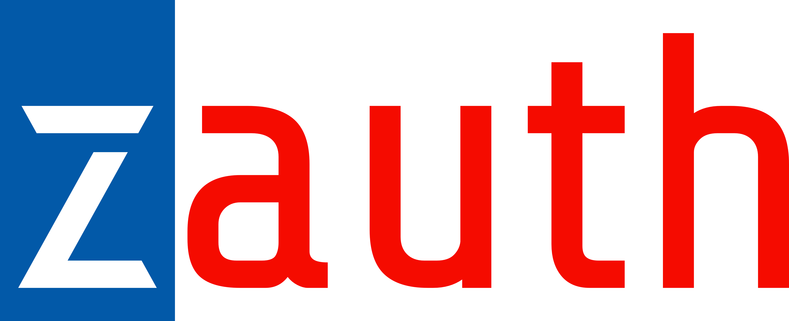

[//]: # (![ZAuth Logo]&#40;./docs/zauth-logo.png&#41;)

## ZAuth - Multi-Tenant Authentication System

   
  
   V3 - <i>Porting in progress</i>
   

ZAuth is a multi-tenant authentication service and much more.
It allows you to manage the entire user lifecycle for your companies.
It is written in Scala, uses ZIO, and is highly performant and configurable.

This project is part of an entire ecosystem of services that allow you to
independently manage users for your activities.
If you like the project, please support it as much as you can.
Thank you in advance.

  

[//]: # ([![Donate]&#40;https://www.paypalobjects.com/en_US/i/btn/btn_donate_LG.gif&#41;]&#40;https://www.paypal.com/donate/?hosted_button_id=QNPRZCZXYYCX2&#41;)

### Usage

Compile code with `sbt compile`, run it with `sbt xauthApi/run`, and `sbt console` will start a Scala 3 REPL.

### Run Tests

`sbt`
`project xauthUtil`
`test`

or

`sbt xauthUtil/test`

## License

This project is released under **[Z-Auth License V1](./LICENSE)** which is **GNU GPL v3** with an
additional clause that **prohibits offering it as a public SaaS without written permission**.

You may:
- Use and modify the software freely.
- Redistribute forks or modified versions under GPLv3 terms.

You may not:
- Offer the software as a public SaaS without authorization.

For commercial agreements or special licensing, contact enrico.russo.84@gmail.com.
